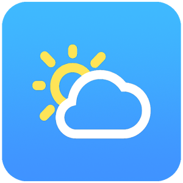

# Weather App 
> Android application

Simple android weather application, which shows weather for different places all over the world.

## Screenshots
- [Main menu](https://github.com/sindresorhus/pageres) - Project logo. Clear description of what the project does. Build badges. Demo screenshot. Simple install and usage sections. Includes an examples section with common uses.

## API
- [API](http://openweathermap.org/) - OpenWeatherMap API which service data about current and forecast weather in json format.

## Contribute

Contributions are always welcome!

## Application version

Current version on [Play Store](https://play.google.com/store/apps/details?id=com.povio.com.povio.weatherapp) is 2.6.3.
